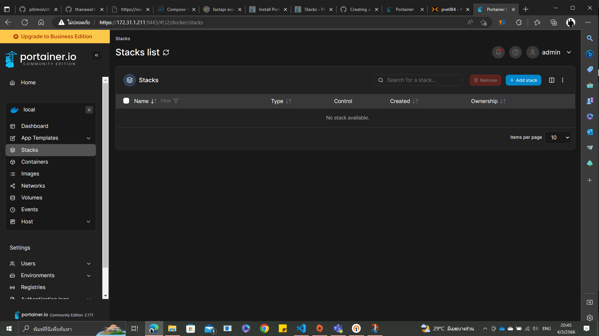
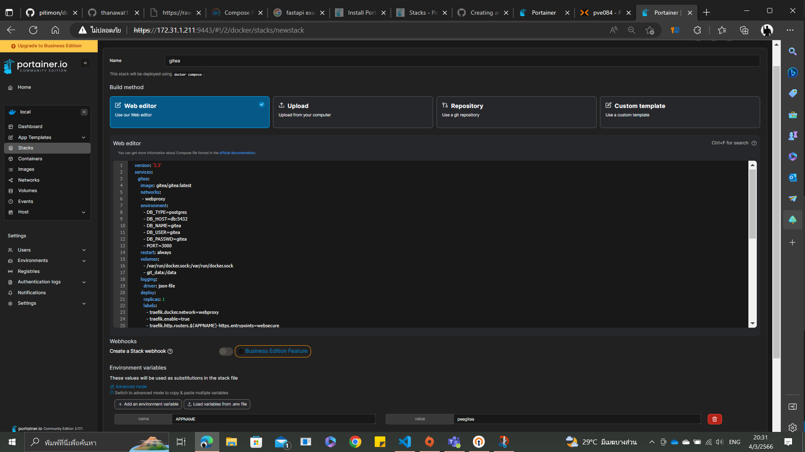
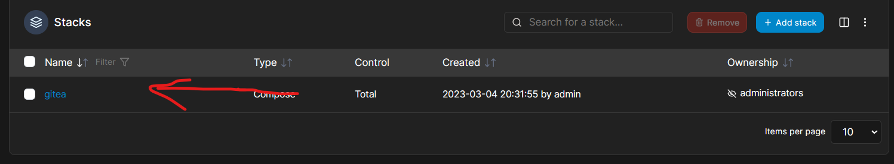
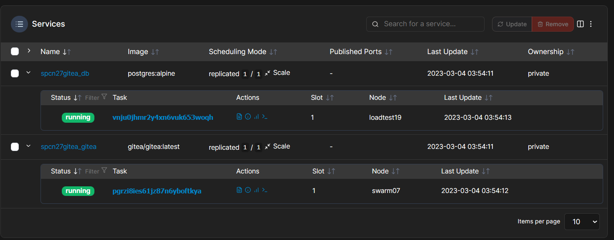
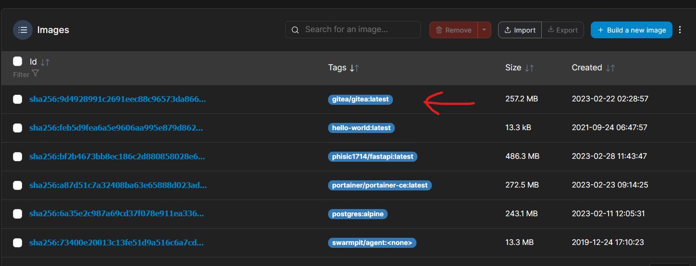

# Gitea website use Postgres DB by Docker compose and Reverse Proxy for Linux Ubuntu. (Gitea website ใช้ Postgres DB โดย Docker compose และ Reverse Proxy สำหรับ Linux Ubuntu)

Hi, My name is Peerapat. I'll will show you how to open **Gitea website use Postgres DB** by Docker compose and make Reverse Proxy to create your Domain name for **Gitea website**.         
(สวัสดีครับ ผมชื่อ พีรพัฒน์ ผมจะมาแสดงวิธีการเปิด **Gitea website ใช้ Postgres** โดย Docker compose และทำ Reverse Proxy เพื่อสร้าง ชื่อโดเมน ของคุณเองสำหรับ **Gitea website**)

|**Contents (สารบัญ)**|
| :-: |
| [Preparation (การเตรียมพร้อม)](#preparation) |
|[Step 1 : compose.yml file (ขั้นตอนที่ 1 : ไฟล์ compose.yml)](#step-1--composeyml-file)|
|[Result (ผลลัพธ์)](#result)|
|[Reference (อ้างอิง)](#reference)|

## Preparation 
(การเตรียมพร้อม) [top⬆️](#gitea-website-use-postgres-db-by-docker-compose-and-reverse-proxy-for-linux-ubuntu-gitea-website-ใช้-postgres-db-โดย-docker-compose-และ-reverse-proxy-สำหรับ-linux-ubuntu)

---
1. [Install Docker Engine.](https://github.com/pitimon/dockerswarm-inhoure) 

     (ติดตั้ง Docker Engine)
2. [Create Portainer CE with Docker Swarm Service easier to compose without command line and share Node to be able to work the same.](https://github.com/pitimon/dockerswarm-inhoure) 

     (สร้าง Portainer CE กับ Docker Swarm Service เพื่อง่ายต่อการ compose โดยไม่ต้องใช้ command line และสามารถแบ่ง Node ให้สามารถทำงานเหมือนกันได้)
3. [Create Traefik Service for allow to use Reverse Proxy in compose file.](https://github.com/pitimon/dockerswarm-inhoure/tree/main/ep03-traefik)  
(สร้าง Traefik Service สำหรับให้ใช้ Reverse Proxy ใน compose ไฟล์)
4. Create Network name webproxy by this commande below      
(สร้าง Network ชื่อ Webproxy จากคำสั่งนี้)

          docker network create -d overlay --attachable webproxy
## Step 1 : compose.yml file 
(ขั้นตอนที่ 1 : ไฟล์ compose.yml) [top⬆️](#gitea-website-use-postgres-db-by-docker-compose-and-reverse-proxy-for-linux-ubuntu-gitea-website-ใช้-postgres-db-โดย-docker-compose-และ-reverse-proxy-สำหรับ-linux-ubuntu)

---
I'll create compose file to command to create service and make reverse proxy. 

(ผมจะสร้าง compose file เพื่อเป็นคำสั่งในการสร้าง service และทำ reverse proxy)
1. Create compose file you can use compose.yml file from this repository or create by your own but I'll explain my script inside compose.yml. 

     (สร้างไฟล์ compose คุณสามารถใช้ compose.yml file จาก repository นี้ หรือสร้างของคุณเอง แต่ผมจะอธิบาย script ข้างใน compose.yml)
     <details>
     <summary>Clicke me!!</summary>

     ```ruby
     version: '3.3' 
     # Declare compose version(ประกาศ compose version)
     services: 
     # Declare to create services (ประกาศที่จะสร้าง services)
      gitea: 
      # Declare gitea services (ประกาศ gitea services)
       image: gitea/gitea:latest 
       # Pull tag of gitea latest version (ดึง tag ของ gitea version ล่าสุด)
       networks: 
       # Declare networks for gitea services (ประกาศ networks ที่จะใช้สำหรับ gitea) 
          - webproxy 
          # network name webproxy (network ชื่อ webproxy)
       environment: 
       # Declare environment (ประกาศตัวแปรสภาพแวดล้อมของ Services)
          - DB_TYPE=postgres 
          # Set Database type is postgres (ใช้ Database ชนิดคือ postgres)
          - DB_HOST=db:5432 
          # Set Hostname db from db service and port 5432 (ใช้ชื่อ Host ว่า db จาก db service และ ใช้ port 5432)
          - DB_NAME=gitea 
          # Set Database name is gitea (ตั้งชื่อ Database ว่า gitea)
          - DB_USER=gitea 
          # Set Database username is gitea (ตั้ง username ว่า gitea)
          - DB_PASSWD=gitea 
          # Set Database password is gitea (ตั้ง password ว่า gitea)
          - PORT=3000 
          # Set gitea use port 3000 (ตั้งให้ gitea ใช้ port 3000)
       restart: always 
       # Set restart service always(ตั้งให้ restart service ตลอดเวลา)
       volumes: 
       # Declare volumes tag (ประกาศที่จะตั้ง tag ให้ volumes)
          - /var/run/docker.sock:/var/run/docker.sock 
          # Create volume tag Docker socket path (สร้าง tag volume สำหรับที่อยู่ Docker socket)
          - git_data:/data  
          # Create volume tag for git data (สร้าง tag volume สำหรับที่อยู่ git data)
       logging: 
       # Create logging (สร้างการเก็บ log)
          driver: json-file 
          # Declare driver for logging type json (ประกาศการเก็บ log แบบ json)
       deploy: 
       # Declare deploy (ประกาศ การ Deploy)
          replicas: 1 
          # set 1 replicas (ตั้งการทำ deploy แค่ 1 ครั้ง)
          labels: 
          # Declare labels to create Reverse Proxy (ประกาศที่จะสร้าง label สำหรับทำ Revers Proxy)
            - traefik.docker.network=webproxy 
            # Set network for Traefik (ตั้ง network สำหรับ Traefik)
            - traefik.enable=true 
            # Enable Traefik (เปิดใช้ Traefik)
            - traefik.http.routers.${APPNAME}-https.entrypoints=websecure 
            # Set Entrypoint (ตั้งการเริ่มต้นประมวลผล)
            - traefik.http.routers.${APPNAME}-https.rule=Host("${APPNAME}.xops.ipv9.me") 
            # Set Hostdomain for open gitea website (ตั้ง Hostdomain สำหรับเข้าใช้ gitea website)
            - traefik.http.services.${APPNAME}.loadbalancer.server.port=3000 
            # Set port for loadbalance (ตั้ง Port สำหรับทำ loadbalance)
          resources: 
          # Declare resources for deploy (ประกาศทรัพยากรสำหรับการ deploy)
          reservations: 
          # Declare resources reservations (ประกาศการจองทรัพยากร) 
               cpus: '0.1' 
               # Use CPU 1 Core (ใช้ CPU 1 Core)
               memory: 10M 
               # Use Memory 10 Megabyte (ใช้หน่วยความจำ 10 Megabyte)
          limits: 
          # Declare resources limits (ประกาศการจำกัดทรัพยากร)
               cpus: '0.4' 
               # Limit CPU 4 Core (จำกัด CPU 1 Core)
               memory: 250M 
               # Limit Memory 250 Megabyte (จำกัดหน่วยความจำ 250 Megabyte)
      db: 
      # Declare db services (ประกาศ db services) 
        image: postgres:alpine 
        # Pull tag of postgres alpine version (ดึง postgres ของ gitea version alpine) 
        networks: 
        # Declare networks for db services (ประกาศ networks ที่จะใช้สำหรับ db) 
          - webproxy 
          # network name webproxy (network ชื่อ webproxy)
        environment: 
        # Declare environment (ประกาศตัวแปรสภาพแวดล้อมของ Services)
          - POSTGRES_USER=gitea 
          # Set postgres username is gitea (ตั้ง username ว่า gitea)
          - POSTGRES_PASSWORD=gitea 
          # Set postgres password is gitea (ตั้ง password ว่า gitea)
          - POSTGRES_DB=gitea 
          # Set Database name for postgres is gitea (ตั้งชื่อ Database สำหรับ postgres ว่า gitea)
        restart: always 
        # Set restart service always(ตั้งให้ restart service ตลอดเวลา)
        volumes: 
        # Declare volumes tag (ประกาศที่จะตั้ง tag ให้ volumes)
          - db_data:/var/lib/postgresql/data 
          # Create volume tag for db data (สร้าง tag volume สำหรับที่อยู่ db data)
        expose: 
        # Declare expose (ประกาศการเปิดใช้)
          - 5432 
          # expose port 5432 (เปิดใช้ Port 5432)
     volumes: 
     # Declare to create volumes (ประกาศที่จะสร้าง volumes)
       db_data: 
       # Create Volumes from db_data tag (สร้าง volume จาก tag db_data )
       git_data: 
       # Create Volumes from git_data tag (สร้าง volume จาก tag git_data )
     networks: 
     # Declare Network (ประกาศการใช้ Network)
      webproxy: 
      # Declare  Network name (ประกาศการใช้ชื่อ Network)
       external: true 
       # set external network (ตั้งการใช้ network จากภายนอกของ service ที่มีอยู่แล้ว)
     ```
     </details>

     from my Scripts you can see this variable.
     
      (คุณเห็นตัวแปรจากที่ผมเขียนตัวนึงตามนี้)

          ${APPNAME}
     You can Edit them for your own or create .env file to setting value for this variable.
     
      (คุณสามารถแก้ไขให้เหมาะสมกับคุณ หรือ สร้างไฟล์ .env เพื่อตั้งค่าสำหรับตัวแปรที่กล่าวไว้)

2. Compose Up this compose.yml file to stack you can use this 2 optional solution 

     (ทำการ Compose Up compose.yml file นี้ไปยัง stack โดยสามารภเลือกทำได้ 2 วิธีนี้)

     - Use command line below 
     
          (ใช้คำสั่งตามนี้)

               docker stack deploy -c compose.yml gitea

     - Use Portainer follow step below 
     
          (ใช้ portainer โดยทำตามนี้)
          - open portainer select **Stack menu** and select **Add Stack** 
          
               (เข้า portainer เลือก **เมนู stack** และ **เลือก Add Stack**)
          
          - Copy Scripts inside compose.yml file insert them in **Web editor** Text box Entry Stack name and set your enviroment variable "APPNAME" or you can change by yourself in scripts and then deploy 
          
               (คัดลอก Scripts ภายใน compose.yml file ใส่ทั้งหมดลงใน กล่องข้อความ **Web editor** ตั้งชื่อ Stack และ ตั้ง ค่าตัวแปรสภาพแวดล้อม "APPNAME" หรือ คุณสามารถ แก้ไขมันเองได้ ใน scripts จากนั้น ทำการ deploy)
          

---

***Thank you For visit my tutorial. Hope it will help you and Sorry for my poor English*** 

***(ขอบคุณสำหรับการเยี่ยมชม tutorial ของผลหวังว่ามันจะช่วยคุณ และ ขออภัยสำหรับความอ่อนของ ภาษาอังกฤษของผลครับ)***

---

## Result 
(ผลลัพธ์) [top⬆️](#gitea-website-use-postgres-db-by-docker-compose-and-reverse-proxy-for-linux-ubuntu-gitea-website-ใช้-postgres-db-โดย-docker-compose-และ-reverse-proxy-สำหรับ-linux-ubuntu)

---
1. In Stack menu you can see your stack after deploy  that appear. 

     (ในเมนู Stack คุณจะเห็น stack หลังจากที่คุณ deploy แล้วจะแสดงขึ้นมา)

2. Inside Stack you can see status and detail of service. all of them depending on compose.yml scripts that you wrote. for my example i have two service that i set in compose.yml and now in portainer service it's shown me two service too. 

     (ข้างใน Stack คุณสามารถเห็นการแสดง สถานะ และรายละเอียดของ Service ที่ทำงาน ทั้งหมดจะขึ้นอยู่กับ compose.yml scripts ที่เราเขียนไว้ ยกตัวอย่างสำหรับผม ผมมี 2 service ซึ่ง ตั้งไว้ใน compose.yml และใน portainer ตอนนี้มันก็แสดงให้ผมเห็น 2 Services เช่นกัน)



3. In Image Menu you can see your Image and Tag from this menu. the tag of image will pulling gitea from Docker hub.

     (ใน เมนู Image คุณสามารถเห็น Image ของคุณ และ Tag จาก เมนูนี้ โดย Tag ของ image gitea จะดึงมาจาก Docker hub โดยตรง)

     
4.  This's my URL after Create Reverse Proxy and Deploy compose file. The result will shown Gitea Website 

     (นี่คือ URL ของผม ที่หลังจากการสร้าง Reverse Proxy และ Deploy compose file ผลลัพธ์จะแสดง Gitea Website)

     https://peegitea.xops.ipv9.me

     


In my opinion, Inside image they contain Script command to run their website code such as NodeJS command and compose file will pulling them to operate their website by their image and make Reverse Proxy to easier for open web app without declare port on url and set your own Domain name.

(ในความเห็นผม ภายใน image พวกเขาได้ใส่ Script คำสั่งเพื่อ run เว็ปไซต์ code ของพวกเขาเช่นพวกคำสั่ง NodeJS และ compose file จะดึง image จากพวกเขามาให้เว็ปไซต์ทำงานโดย Image ของพวกเขา และ ทำ Reverse Proxy เพื่อง่ายต่อการเข้า web app โดยไม่ต้อง ประกาศ port ลงบน url และ ตั้งค่า Domain name ให้ตัวเอง)

---

***Thank you For visit my tutorial. Hope it will help you and Sorry for my poor English*** 

***(ขอบคุณสำหรับการเยี่ยมชม tutorial ของผลหวังว่ามันจะช่วยคุณ และ ขออภัยสำหรับความอ่อนของ ภาษาอังกฤษของผลครับ)***

-----
### Reference 
(อ้างอิง) [top⬆️](#gitea-website-use-postgres-db-by-docker-compose-and-reverse-proxy-for-linux-ubuntu-gitea-website-ใช้-postgres-db-โดย-docker-compose-และ-reverse-proxy-สำหรับ-linux-ubuntu)

---
- Source Repository 
     - https://github.com/docker/awesome-compose/tree/master/gitea-postgres
- Docker-Inhoure
     - https://github.com/pitimon/dockerswarm-inhoure
- Repository Wakatime
     - https://wakatime.com/@spcn27/projects/dveleuhxka?start=2023-02-20&end=2023-02-26

---